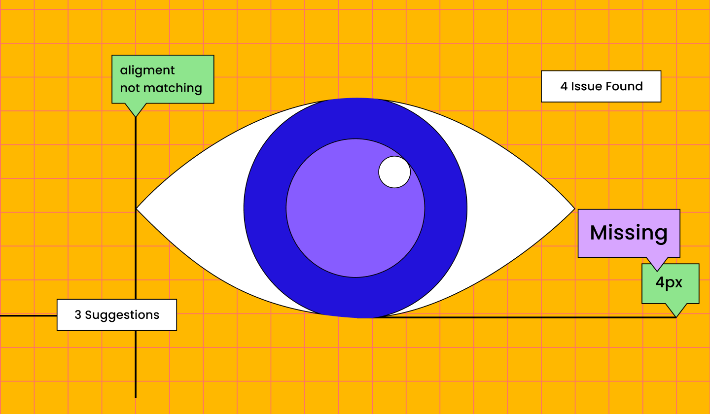
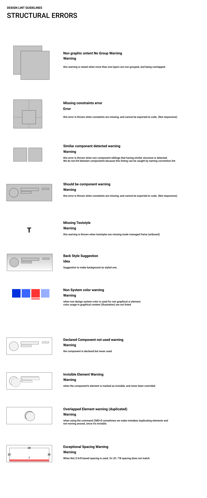

# lint
> lint is currently being developed for [assistant](https://github.com/bridgedxyz/assistant/tree/master/packages), it's dependancy requires this repository to run under /assistant/packages/lint. which you can clone this repository directly, but not stable branches might have some incompatibility among the dependencies.

*reflect's linting plugin & design lint engine*

## Rules & Documentation
available in [figma](https://www.figma.com/file/ED6WOfsoYnnYHY8RJwU9Xw/reflect?node-id=50%3A0)

## Installation

```sh
yarn add @reflect.bridged.xyz/linter
```


## Example

> example plugin for figma available [here](./example/plugin)


## Lints
- Structure Lint
- Visual Lint
- Name Linting


## Docs
[linting specification docs at notion](https://www.notion.so/bridgedxyz/lint-8d231e26f2394dd984594d6de32d47c2)


## Features
**Basics**
- Missing textstyle (missing typography)
- Non Library color (when using non system/library colors)
- Missing Constraints (when no constraint is defined for complex layouts or components)
- Similar Components
- Case lint (when non developer-friendly naming convention is used)
  - wrong naming convention
  - name not defined
- Not used screens
- Not used components
- naming conflicts
  - screen conflict
  - component conflict
- Hidden layers warning
- Overlapped layers warning


**Visual Linting**
- aesthetic rate score
- usability & reachability score
- eye tracking score
- reference score


## Linting standards

> STRUCTURAL (the underlyign graphical resource is owned by bridged.xyz and cannot be used without referencing.)





## References
- https://github.com/destefanis/design-lint
- https://www.figma.com/community/plugin/801195587640428208/Design-Lint
- https://lintyour.design/

